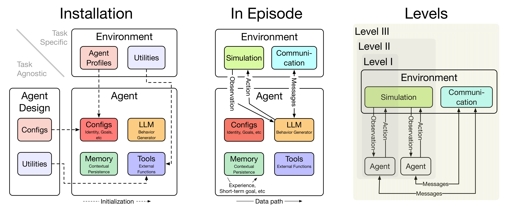

<h1 align="center" style="margin:0;"> <div style="display:flex; align-items:center; justify-content:center; gap:20px;">  <h1 align="center">Shachi (鯱)</h1> </div> <div style="margin-top:10px; font-size:1.3em; font-weight:normal;"> Shachi: A Modular, Controllable Framework for LLM-Based Agent-Based Modeling of Emergent Collective Behavior </div> </h1>

<p align="center">
  <a href="https://github.com/SakanaAI/shachi_refactor/actions/workflows/checks.yml"></a>
  
  <a href="LICENSE"></a>
  <a href="https://github.com/astral-sh/ruff"></a>
  <a href="https://mypy-lang.org/"></a>
  <a href="https://arxiv.org/abs/2509.21862"></a>
  <a href="https://docs.astral.sh/uv/"></a>
  <a href="https://hydra.cc/"></a>
</p>

Shachi is a modular framework designed to simplify building **LLM-based agents** for **Agent-Based Modeling (ABM)**. By separating each agent into four core components—**LLM**, **Tools**, **Memory**, and **Configuration**—Shachi enables reproducible experiments across a variety of social, economic, and cognitive simulation tasks.

<div align="center">

| ❌ Existing LLM-based ABM | ✅ Shachi |
|-----------|---------|
| Brittle, scattered agent designs | **4-core architecture** (LLM, Memory, Tools, Config) |
| Ad-hoc env-agent interfaces | Unified **gym-style API** |
| Low reproducibility & poor reusability | **10-task benchmark + real-world validation** |

</div>


<p align="center">
  
</p>


## Table of Contents
1. [Installation & Dependencies](#installation--dependencies-)
2. [Quickstart](#quickstart-)
3. [Implemented ABM Tasks](#implemented-abm-tasks-)
4. [How to Write Your Agent](#how-to-write-your-agent-)
5. [How to Write Your Environment](#how-to-write-your-environment-)
6. [Execute your Agent and Environments](#execute-your-agent-and-environments-)
7. [Shachi supports Hydra](#shachi-supports-hydra-)
8. [(Extra) Tools & Memory in Practice](#extra-tools--memory-in-practice-)

---

## Installation & Dependencies 📦

### Install `uv` (If Not Already Installed)
```bash
curl -LsSf https://astral.sh/uv/install.sh | sh
```

### (Optional) Pin Python Version

By default, `uv` will select the highest supported Python version (>= 3.10) for Shachi.
Since Shachi has many dependencies that may have compatibility issues with the latest Python versions, you may want to pin Python to a specific version:

```bash
uv python pin 3.12  # Pin Python version for this project only
uv sync             # Install dependencies and verify dependency setup
```
---

## Quickstart ⚡

```bash
export OPENAI_API_KEY="..."
uv run scripts/main.py --config-name "config" task=psychobench agent=psychobench
```

Change `task` / `agent` to switch experiments.

---

## Implemented ABM Tasks 🌐

### List
| Task | Description | Example Run | Reference |
|------|-------------|-------------|-----------|
| **PsychoBench** | Benchmarks psychological decision tasks | `uv run scripts/main.py task=psychobench agent=psychobench` | [arXiv:2310.01386](https://arxiv.org/abs/2310.01386) |
| **LM_Caricature** | Simulates online forum style interactions | `uv run scripts/main.py task=lm_caricature agent=lm_caricature task.scenario=onlineforum` | [arXiv:2310.11501](https://arxiv.org/abs/2310.11501) |
| **Cognitive Biases** | Measures LLM biases (Availability, Anchoring, etc.) | `uv run scripts/main.py task=cognitive_biases agent=cognitive_biases` | [arXiv:2410.15413](https://arxiv.org/abs/2410.15413) |
| **EmotionBench** | Tests emotional recognition & response | `uv run scripts/main.py task=emotionbench agent=emotionbench` | [arXiv:2308.03656](https://arxiv.org/abs/2308.03656) |
| **DigitMat** | Emergent analogical reasoning | `uv run scripts/main.py task=digitmat agent=digitmat` | [arXiv:2212.09196](https://arxiv.org/abs/2212.09196) |
| **StockAgent** | Stock trading simulations | `uv run scripts/main.py task=stockagent agent=stockagent` | [arXiv:2407.18957](https://arxiv.org/abs/2407.18957) |
| **Sotopia** | Multi-agent social simulation | `uv run scripts/main.py task=sotopia agent=sotopia batchsize=30` | [arXiv:2310.11667](https://arxiv.org/abs/2310.11667) |
| **AuctionArena** | Agents in auction environments | `uv run scripts/main.py task=auction_arena agent=auction_arena` | [arXiv:2310.05746](https://arxiv.org/abs/2310.05746) |
| **EconAgent** | Macroeconomic simulations (GDP, inflation, etc.) | `uv run scripts/main.py task=econagent agent=econagent task.episode_length=240 task.num_agents=100` | [arXiv:2310.10436](https://arxiv.org/abs/2310.10436) |
| **OASIS** | Social media simulation (posts, comments, reactions) | `uv run scripts/main.py task=oasis agent=oasis` | [arXiv:2411.11581](https://arxiv.org/abs/2411.11581) |

In addition to the benchmark tasks above, our paper also introduces several exploratory studies:  

* **Carrying Memory to the Next Life**  
* **Living in Multiple Worlds**  
* **LoRA Weight Experiments**

All of these studies are organized under [`docs/exploratory_studies`](docs/exploratory_studies.md).


### Additional Dependencies

* **Cognitive Biases (cognitive-biases-in-llms)**:
  Download `full_dataset.csv` from [this repository](https://github.com/simonmalberg/cognitive-biases-in-llms) to `shachi/env/cognitive_biases/data`.

* **Sotopia**:

  ```bash
  docker rm -f redis-stack  # `sotopia install` fails if this container exists
  uv run sotopia install # (Select "Docker", "Yes", and "Sotopia Dataset (ICLR 2024, CC-BY-SA 4.0) " )
  ```


---

## How to Write Your Agent 🧩

Define your agent by subclassing the abstract base class `Agent` and implementing its single hook: `step(observation) -> str | BaseModel | None`.

When an environment specifies `observation.response_type` (a Pydantic model), the agent must align its output with that schema. This ensures **consistent communication** between agents and environments. Two main approaches are supported:

* **Structured Output**: request the LLM to produce JSON matching the schema.  
* **Function Calling**: expose a function derived from the schema and require the LLM to call it.

This design keeps the agent as a **modular component** within Shachi’s architecture, ensuring that communication remains standardized and reproducible across tasks.

Shachi’s 4-core view of an agent:

* **LLM**: how you call the model (free-form, structured output, or function calling).
* **Tools**: optional side-effect–free functions exposed by the environment.
* **Memory**: optional retrieval of past interactions.
* **Config**: hyperparameters (model name, temperature, etc.).

### 1) Structured Output Agent (Pydantic Schema)

If the environment sets `observation.response_type = SomePydanticModel`, you can request JSON output and parse it safely.

```python
import litellm
from shachi import Agent

class NoMemoryAgent_using_StructuredOutput(Agent):
    def __init__(self, model: str = "openai/gpt-4o-mini", temperature: float = 1.0):
        self.model = model
        self.temperature = temperature

    async def step(self, observation: Observation):
        messages = [{"role": "user", "content": observation.format_as_prompt_payload()}]
        completion = await litellm.acompletion(
            model=self.model,
            messages=messages,
            temperature=self.temperature,
            response_format=observation.response_type,  # << Pydantic model
        )
        json_text = completion.choices[0].message.content
        return observation.response_type.model_validate_json(json_text)
```

### 2) Function-Calling Agent (Tool-Typed Schema)

You can also coerce the model to “call” a function whose parameters mirror your Pydantic response type.

```python
from typing import Literal
import litellm
import pydantic
from shachi import Agent

class NoMemoryAgent_using_FunctionCalling(Agent):
    def __init__(self, model: str = "openai/gpt-4o-mini", temperature: float = 1.0):
        self.model = model
        self.temperature = temperature

    async def step(self, observation: Observation):
        assert observation.response_type is not None
        messages = [{"role": "user", "content": observation.format_as_prompt_payload()}]
        tools = [{
            "type": "function",
            "function": {
                "name": observation.response_type.__name__,
                "description": f"Return a {observation.response_type.__name__}",
                "parameters": observation.response_type.model_json_schema(),
            },
        }]
        completion = await litellm.acompletion(
            model=self.model,
            messages=messages,
            temperature=self.temperature,
            tools=tools,
            tool_choice={"type": "function", "function": {"name": observation.response_type.__name__}},
        )
        call = completion.choices[0].message.tool_calls[0]
        return observation.response_type.model_validate_json(call.function.arguments)
```

---

## How to Write Your Environment 🧪

Define your environment by subclassing the abstract base class `Environment` and overriding the gym-style lifecycle hooks:

* `num_agents() -> int`
* `reset() -> dict[int, Observation]`
* `step(responses) -> dict[int, Observation]`
* `done() -> bool`
* `get_result() -> TResult`

You also define your **message**, **observation**, and **(optional) tool responses** as Pydantic models.

### Minimal Example (Rock–Paper–Scissors)

```python
from typing import Literal
import pydantic
from shachi import Environment, Message, Observation

RPSHand = Literal["rock", "paper", "scissors"]

class RPSMessage(Message):
    hand: RPSHand | None = None

class RPSResponse(pydantic.BaseModel):
    hand: RPSHand

class RPSObservation(Observation[RPSMessage]):
    alive: list[bool]
    def format_as_prompt_text(self) -> str:
        lines = ["Choose: rock, paper, or scissors."]
        lines += [
            f"Opponent {m.src_agent_id} played {m.hand}."
            if m.hand is not None else
            f"Opponent {m.src_agent_id} made an invalid move."
            for m in self.messages
        ]
        return "\n".join(lines)

class RPSEnvironment(Environment):
    def __init__(self, n: int):
        self._n = n
        self.alive = [True] * n
        self.prev: dict[int, RPSHand | None] = {}
        self.t = 0

    def num_agents(self) -> int: return self._n

    def done(self) -> bool: return sum(self.alive) <= 1

    async def reset(self):
        self.alive = [True] * self._n
        self.prev = {}
        self.t = 0
        return self._obs()

    def _obs(self):
        if self.done():
            return {i: RPSObservation(agent_id=i, messages=[], reward=1.0,
                                      response_type=None, alive=self.alive)
                    for i in range(self._n) if self.alive[i]}
        obs: dict[int, RPSObservation] = {}
        for i in range(self._n):
            if not self.alive[i]: continue
            msgs = [
                RPSMessage(time=self.t, src_agent_id=j, dst_agent_id=i, hand=self.prev[j])
                for j in range(self._n)
                if j != i and self.alive[j] and j in self.prev
            ]
            obs[i] = RPSObservation(agent_id=i, messages=msgs, reward=None,
                                    response_type=RPSResponse, alive=self.alive)
        return obs

    @staticmethod
    def _extract_hand(resp) -> RPSHand | None:
        if resp is None: return None
        if isinstance(resp, pydantic.BaseModel): return resp.hand
        try:
            return RPSResponse.model_validate_json(resp).hand
        except pydantic.ValidationError:
            text = str(resp).lower()
            for h in ("rock", "paper", "scissors"):
                if h in text: return h  # type: ignore[return-value]
        return None

    async def step(self, responses):
        self.t += 1
        idx = {"rock": 0, "paper": 1, "scissors": 2}
        valid: dict[int, int] = {}
        for aid, r in responses.items():
            h = self._extract_hand(r)
            self.prev[aid] = h
            if h is not None: valid[aid] = idx[h]
        if len(valid) < 2: return self._obs()
        s = set(valid.values())
        if len(s) in (1, 3): return self._obs()
        winning = (({0, 1, 2} - s).pop() + 2) % 3
        for aid, v in valid.items():
            self.alive[aid] = (v == winning)
        return self._obs()

    def get_result(self):
        return {"alive": self.alive}
```

---

## Execute Your Agent and Environments 📊

You can evaluate programmatically (handy for notebooks/CI) or via CLI/Hydra. This mirrors the provided `Usage` example and runs multiple episodes.

```python
import asyncio

N_EPISODES = 10

async def run():
    agents = [
        NoMemoryAgent_using_StructuredOutput(),
        NoMemoryAgent_using_FunctionCalling(),
    ]
    env = RPSEnvironment(len(agents))
    total = {i: 0.0 for i in range(len(agents))}

    for _ in range(N_EPISODES):
        observations = await env.reset()
        while not env.done():
            futures = {i: agents[i].step(obs) for i, obs in observations.items()}
            responses = dict(zip(futures.keys(), await asyncio.gather(*futures.values())))
            observations = await env.step(responses)
            for i, obs in observations.items():
                if obs.reward is not None:
                    total[i] += obs.reward

    print("Total rewards:", total)

if __name__ == "__main__":
    asyncio.run(run())
```

## Shachi Supports Hydra 🚀

Use the unified entrypoint and change configs on the fly:

```bash
# Psychobench with its default agent
uv run scripts/main.py --config-name "config" task=psychobench agent=psychobench

# Switch to Sotopia and increase batch size
uv run scripts/main.py --config-name "config" task=sotopia agent=sotopia batchsize=30

# EconAgent with longer horizon and more agents
uv run scripts/main.py --config-name "config" task=econagent agent=econagent \
  task.episode_length=240 task.num_agents=100
```

### Cross-Evaluation of Agent Designs
In Shachi, agents and environments are implemented in a **decoupled** manner, which makes it easy to swap and combine them freely.  
For example, you can run the **OASIS** environment with the **StockAgent** agent:

```bash
uv run scripts/main.py --config-name "config" 'task=oasis' 'agent=stockagent'
```

### Swapping Backend LLMs

In Shachi, each component of an agent is implemented as a modular part, which allows the backend model to be easily customized.
You can use not only standard APIs but also endpoints of your own locally hosted models (e.g., via vLLM).
For example, `config/agent/oasis.yaml`:

```yaml
_target_: src.shachi.agent.oasisagent.create_agents_functioncalling
num_agents: 0
model: "openai/gpt-4o-mini"   # Replace with your preferred model
temperature: 0.5
memory_cls_path: src.shachi.agent.oasisagent.CamelMemory
memory_cls_kwargs:
  window_size: 5
```

---

## (Extra) Tools & Memory in Practice 🧰

The base interfaces include:

* `Tool[TParameters]` with a `fun(params) -> ToolResponse`, and `ToolResponse.format_as_prompt_text()`.
* `BaseMemory` with `add_record`, `retrieve`, `clear`.

### Minimal Memory (Sliding Window)

```python
from collections import deque
from shachi import BaseMemory

class SlidingWindowMemory(BaseMemory):
    def __init__(self, k: int = 20):
        self.k = k
        self.buf = deque(maxlen=k)

    def add_record(self, messages: list[dict[str, str]]):
        self.buf.extend(messages)

    def retrieve(self, query: str | None = None) -> str:
        # minimal: ignore query, just return joined texts
        return "\n".join(m["content"] for m in self.buf if "content" in m)

    def clear(self):
        self.buf.clear()
```

### Minimal Tool

```python
import pydantic
from shachi import Tool, ToolResponse

class AddParams(pydantic.BaseModel):
    a: float
    b: float

class AddResponse(ToolResponse):
    params: AddParams
    result: float
    def format_as_prompt_text(self) -> str:
        return f"add({self.params.a}, {self.params.b}) = {self.result}"

def add_fun(p: AddParams) -> AddResponse:
    return AddResponse(params=p, result=p.a + p.b)

add_tool = Tool(
    name="add",
    description="Add two numbers",
    parameters_type=AddParams,
    fun=add_fun,
)
# Environments can inject [add_tool] into `Observation.tools`
```

Agents read `observation.tools` and typically expose them to the LLM via function-calling.  

For concrete implementations, see [Memory in `src/shachi/agent/stockagent.py`](src/shachi/agent/stockagent.py) and [Tool usage in `src/shachi/env/stockagent/stockenv.py`](src/shachi/env/stockagent/stockenv.py).


## Citation ✍️

If you use `Shachi` in your research, please cite it as follows:

```
@article{kuroki2025shachi,
  title={Reimagining Agent-based Modeling with Large Language Model Agents via Shachi},
  author={Kuroki, So and Tian, Yingtao and Misaki, Kou and Ikegami, Takashi and Akiba, Takuya and Tang, Yujin},
  journal={arXiv preprint arXiv:2509.21862},
  year={2025}
}
```
