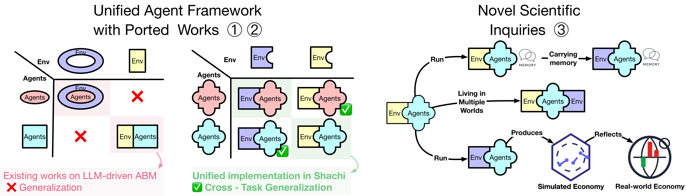

# 探索的研究（Exploratory Studies）


本ドキュメントでは、**Shachi** によって可能になる以下を含む高度な研究セットアップについて説明する。

- メモリを次の生（life）へ持ち越す
- 複数の世界で生きる
- LoRA 重み実験

<p align="center">
  
</p>


---

## メモリを次の生へ持ち越す 🧬

Shachi では、エージェントがメモリを持ち越すことで、環境をまたいで経験を持続させることができる。
まず、ある環境でエージェントの状態を（例えば `.pkl` として）保存し、それを別の環境に読み込む。

```bash
uv run scripts/main_carrying_memory.py   # 実行前に pkl_path を置き換える
```

これにより、エージェントは過去の経験を転移し、環境横断的な適応を示すことができる。

---

## 複数の世界で生きる 🌍

エージェントは、1 回の連続した実行のなかで複数のタスク間を移動することもできる。
例えば、株式取引シミュレーションから始めて、その後ソーシャルメディアへ移動する。

```bash
uv run scripts/main_stock_oasis.py
```

この例では、同一のエージェントが **OASIS** と **StockAgent** の双方で生き、ドメインをまたいで知識を持ち越すことで、複数ドメインにわたる相互作用を可能にする。

---

## LoRA 重み実験 🎛️

プロンプトベースのプロファイリングにとどまらず、Shachi は **LoRA 重みの改変** に関する実験をサポートし、それが LLM の振る舞いに与える影響を研究することができる。
例えば、**SOTOPIA-π** の重みを適用する場合：

```bash
uv run scripts/main_vllm.py --config-name "config_vllm" 'task=psychobench' 'agent=sotopia_vllm' 'launcher/vllm=sotopia_pi'
```
